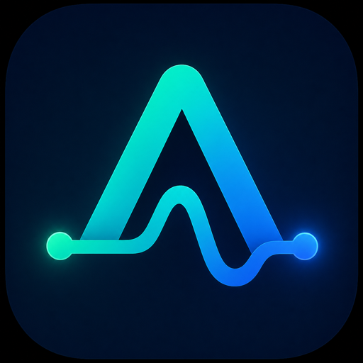
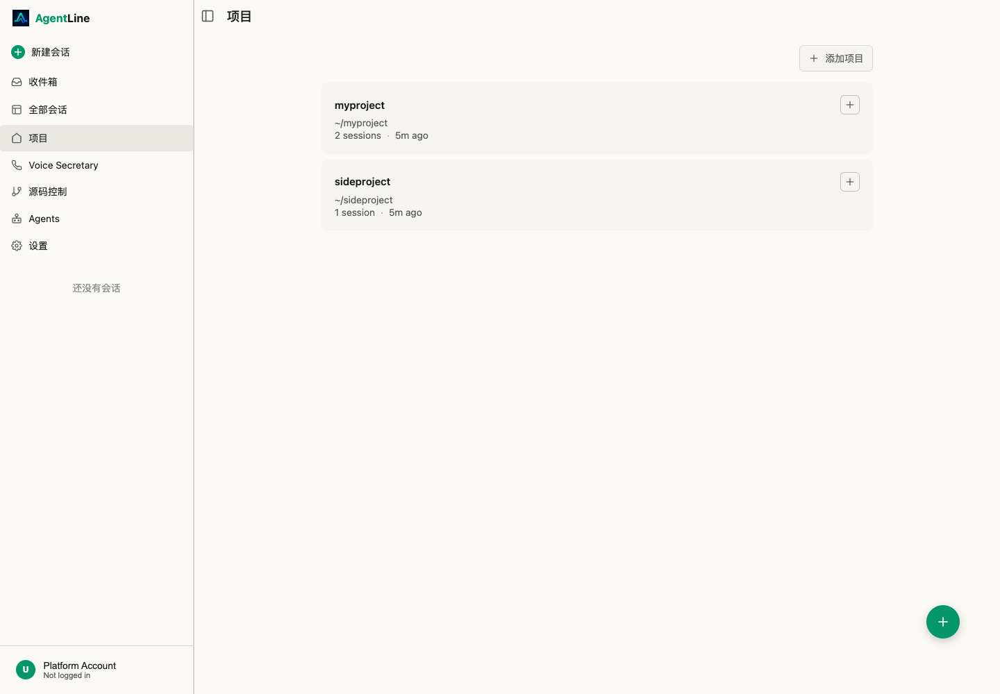
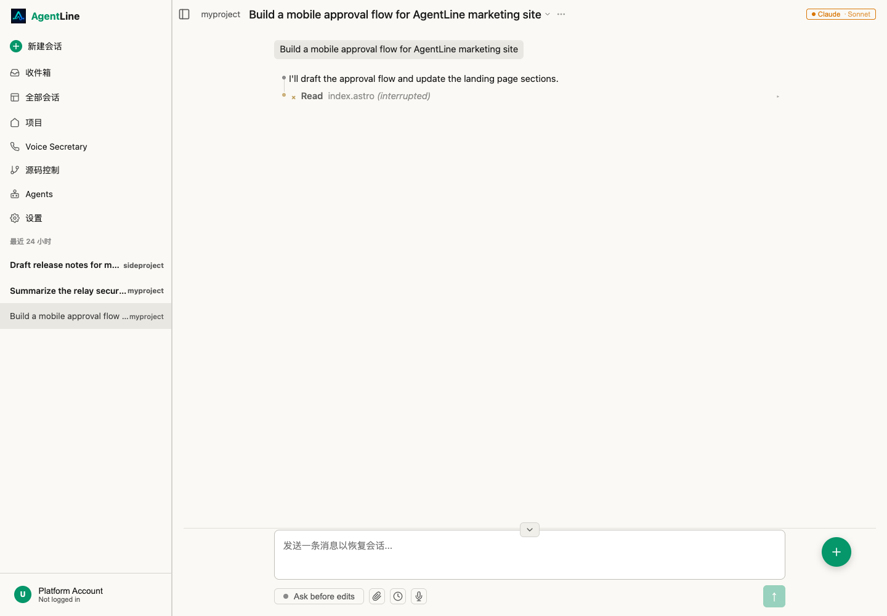
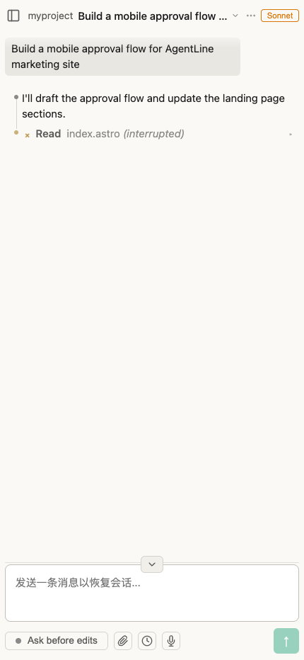
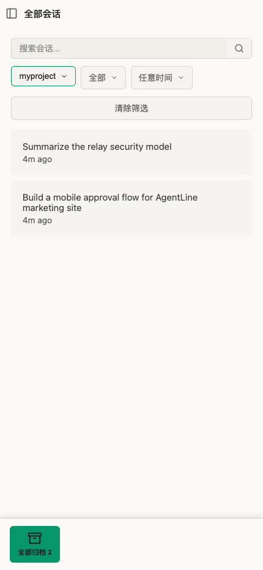
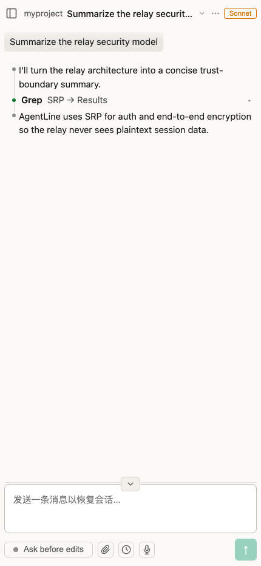

  

<h1 align="center">AgentLine</h1>

  <strong>A local-first, multi-device control surface for AI agents.</strong>

  <a href="README.md">简体中文</a>
  ·
  <a href="README.en.md">English</a>
  ·
  <a href="README.ja.md">日本語</a>

  
  
  

AgentLine is a local-first supervision console for AI coding agents. It keeps Claude Code, Codex, Gemini, and OpenCode-style sessions running on your own development machine while bringing supervision, approvals, progress review, and remote handoff to desktop, phone, and tablet.

The core idea is simple: the agent process stays local; the control surface can move.

It is built for moments like these:

- A long-running task is still active after you leave the desk, and you need to check progress or add context.
- The agent needs command approval, a diff review, a file decision, or a quick unblock.
- You are running multiple projects or providers and do not want to bounce between terminal windows.
- You want remote supervision of your own development machine without moving code and credentials into a hosted cloud runner.

## Current Status

- Latest public release: [v1.0.5](https://github.com/april-jk/AgentLine/releases/tag/v1.0.5)
- Desktop downloads: macOS DMG, Windows installer/portable executable, Linux AppImage and DEB
- Mobile downloads: Android APK in the GitHub Release; iOS is currently distributed through TestFlight collection on the website

The npm package tarball exists for release bookkeeping, but the recommended install path today is the GitHub Release desktop/mobile builds.

## What It Does

- **Server-owned sessions**: agent processes run on your development machine, so closing a browser or switching devices does not stop the work.
- **Multi-session overview**: see projects, active sessions, recent runs, and attention states without cycling through terminal windows.
- **Mobile supervision**: review progress, answer prompts, approve actions, inspect diffs, and send follow-up messages from a phone.
- **Provider-aware session handling**: read and normalize sessions from Claude, Codex, Gemini, and OpenCode storage/event formats.
- **Remote device control**: stream Android devices, Android emulators, and iOS Simulators for mobile development checks.
- **File and media workflow**: upload screenshots, photos, PDFs, and code files into sessions from mobile or desktop.
- **Push-oriented triage**: surface the sessions that need attention before the ones that are merely recent.

## Positioning

AgentLine is not a hosted cloud agent platform, and it does not custody your model accounts. It is a movable control plane for local agent workflows:

- **Local-first**: code, CLIs, credentials, and long-running tasks stay on your machine by default.
- **Multi-device handoff**: the desktop app stays resident; the phone handles approvals, review, and quick responses.
- **Multi-provider overview**: sessions from different agent CLIs appear in one organized workspace.
- **Open source contribution path**: features, downloads, roadmap work, and issue tracking live in GitHub.

## Supported Providers

| Provider | Status | Notes |
| --- | --- | --- |
| Claude Code | Primary | Uses the official Anthropic Agent SDK and the user's own Claude credentials. |
| Claude Ollama | Optional | Local-model path for Claude-style workflows through Ollama. |
| Codex | Primary | Uses the Codex integration for cloud-backed coding sessions. |
| Codex OSS | Optional | Uses Codex with local models via Ollama. |
| Gemini ACP | Experimental | Uses Gemini CLI ACP support for interactive agent sessions. |
| OpenCode | Experimental | Uses OpenCode server/session surfaces for multi-provider workflows. |

Provider availability is detected from the installed CLIs and local configuration.

## Screenshots

  
  

  
  
  

## Install

For most users, download directly from the [latest GitHub Release](https://github.com/april-jk/AgentLine/releases/tag/v1.0.5):

| Platform | Direct download |
| --- | --- |
| macOS | [Download DMG](https://github.com/april-jk/AgentLine/releases/download/v1.0.5/AgentLine.Desktop-1.0.5-arm64.dmg) |
| Windows | [Download installer](https://github.com/april-jk/AgentLine/releases/download/v1.0.5/AgentLine.Desktop.Setup.1.0.5.exe) / [Download portable](https://github.com/april-jk/AgentLine/releases/download/v1.0.5/AgentLine.Desktop.1.0.5.exe) |
| Linux | [Download AppImage](https://github.com/april-jk/AgentLine/releases/download/v1.0.5/agentline-desktop-1.0.5-x86_64.AppImage) / [Download DEB](https://github.com/april-jk/AgentLine/releases/download/v1.0.5/agentline-desktop-1.0.5-amd64.deb) |
| Android | [Download APK](https://github.com/april-jk/AgentLine/releases/download/v1.0.5/AgentLine-Mobile-RN-1.0.5-android.apk) |
| iOS | [Join the TestFlight collection flow](https://agentline.oneceo.ai/#install) |
| Other assets | [View full Release](https://github.com/april-jk/AgentLine/releases/tag/v1.0.5) |

After installing the desktop app, keep it running on the machine that should own the agent sessions. Use the Android app or a mobile browser to supervise from another device.

## Architecture

- `packages/server`: Hono server, provider adapters, session readers, push and file APIs
- `packages/client`: React web app and remote client bundle
- `packages/desktop-electron`: Electron desktop shell and release packaging
- `packages/mobile-rn`: React Native mobile app
- `packages/shared`: shared protocol, schema, provider, and relay constants
- `site`: Astro marketing site and GitHub Pages deployment

## Star History

<a href="https://www.star-history.com/#april-jk/AgentLine&type=date&legend=top-left">
  <picture>
    <source media="(prefers-color-scheme: dark)" srcset="https://api.star-history.com/svg?repos=april-jk/AgentLine&type=date&legend=top-left&theme=dark" />
    <source media="(prefers-color-scheme: light)" srcset="https://api.star-history.com/svg?repos=april-jk/AgentLine&type=date&legend=top-left" />
    
  </picture>
</a>

## License

MIT
