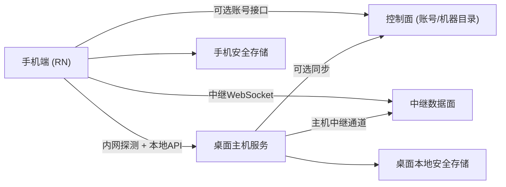

# AgentLine 离线优先的账号与主机架构设计

日期：2026-05-10  
状态：待评审（草案）

## 阅读方式（渐进式加载）

- `L0（5分钟）`：先看产品形态和不可变规则。
- `L1（15分钟）`：看完整链路与核心流程。
- `L2（30分钟+）`：看数据模型、接口边界、安全与故障策略。

---

## L0 - 一页总览

### 1. 目标

我们要建立一套统一连接模型，同时满足：

1. 在完全离线、未登录状态下，局域网直连可用。
2. 登录用户可快速看到自己账号下的机器并连接（优先内网，失败再中继）。
3. 中继连接首次也必须过“主机访问密码”。
4. 密码只存本地，不上云。

### 2. 已确认硬约束

1. 应用必须支持完全离线使用。
2. 登录是可选增强，不是前置条件。
3. 首次连接必须输入密码（直连与中继一致）。
4. 仅当用户明确同意“保存在本机”后才允许后续免密。
5. 密码/凭据只能保存在桌面端本地和手机端安全存储，云端不可保存可还原密码。
6. 归属模型：一个 owner 可有多台机器；机器可转移；同一时刻仅一个 owner，以桌面端当前登录用户为准。

### 3. 实现原则

1. 复用现有 `RemoteAccessService`、SRP verifier、WebSocket 认证策略作为主机访问密码的技术底座。
2. 不新建一套平行认证系统；新增设计应作为现有 SRP/远程访问能力的升级层。
3. 控制面只负责账号、机器目录、LAN/relay 元数据；主机访问授权始终由桌面主机服务决定。
4. 移动端主路径应是“机器列表/扫描结果 -> 选择机器 -> 首连密码”，旧的 relay username/password 表单只能作为高级调试入口保留。

### 4. 架构快照

### 5. 连接优先级

1. 有内网地址则先走内网直连。
2. 内网失败且存在中继信息时再回退中继。
3. 两者均失败时给出恢复引导（同网段、桌面在线、中继开关状态）。

---

## L1 - 系统设计

### 1. 分层职责

1. `桌面主机服务`（权威执行端）
- 随桌面应用启动。
- 托管会话执行与远程控制入口。
- 对外发布内网能力和可选中继在线状态。
- 基于现有 `RemoteAccessService` / SRP verifier 强制执行首次密码校验与信任设备策略。

2. `手机客户端`
- 通过内网扫描和账号机器目录发现目标主机。
- 在每次连接时决策直连或中继路径。
- 仅在本机安全存储中保存受信凭据。
- 主入口展示机器/主机候选，不再要求普通用户理解 relay username。

3. `控制面（可选）`
- 管理账号身份、机器绑定、在线元数据。
- 不参与密码托管，不保存可逆访问密码。
- 当前已有 `/api/v1/devices`，目标演进为 `/api/v2/machines`，迁移期保留 v1 兼容层。

4. `中继数据面`
- 负责加密消息转发。
- 不解密业务内容，不持有主机访问密码。

### 2. 现有系统映射

1. `RemoteAccessService`
- 当前已保存 SRP salt/verifier，且密码不落明文。
- 目标是把它从“relay username 的远程访问密码”升级为“主机访问密码”，供直连与中继共用。

2. `ws-auth-policy` / `ws-transport-auth`
- 当前已经区分本地可信、cookie 可信、SRP 必需等连接策略。
- 目标是在非 loopback 的直连与中继路径上统一触发主机访问认证。

3. `/api/v1/devices`
- 当前控制面已存在用户、会话、设备、relay username 和心跳。
- 目标 v2 不应推倒重来，而是把 `device` 语义扩展/迁移为 `machine`，并补齐 LAN endpoints 与 owner 转移。

4. 移动端 `LoginScreen`
- 当前还保留 direct username/password 与 relay username/password 表单。
- 目标主流程应被“扫描/账号机器列表/手动地址”的候选列表取代，旧表单降级为高级调试。

### 3. 核心流程

#### 流程 A：离线直连（未登录）

1. 桌面端启动主机服务。
2. 手机端按网段扫描（默认主网卡 IP 的 `/24`，禁止 `127.0.0.0/24`）。
3. 发现主机后发起连接。
4. 主机要求输入访问密码（首次）。
5. 用户输入后可选择“仅在本机保存”。
6. 已保存且未撤销时，后续同设备可免密。

#### 流程 B：登录后内网优先

1. 桌面登录账号并绑定机器。
2. 桌面通过心跳上报 LAN endpoint、relay endpoint、监听状态与最后更新时间。
3. 手机登录同账号拉取机器列表。
4. 手机优先尝试未过期的内网端点。
5. 内网成功则直接进入控制（低延迟）。
6. 内网失败再自动回退中继。

#### 流程 C：登录后中继连接

1. 桌面开启中继并维持主机通道在线。
2. 手机从机器列表选择目标机器并建立中继客户端通道。
3. 首次中继连接同样要求主机访问密码。
4. 成功后可下发本机受信凭据用于后续免密。

### 4. 机器归属与转移

1. 每台机器在任一时刻只有一个 `activeOwnerUserId`。
2. 桌面端登录新账号时触发归属转移流程。
3. 转移不继承旧 owner 的本地受信凭据。
4. 转移完成后，旧 owner 从账号机器列表不再具备快速连接权限。
5. 桌面端未登录时，机器仍可离线直连，但不向控制面声明新的 active owner。
6. 控制面不可达时，桌面保留本地运行状态；owner 变更待控制面恢复后再同步确认。

### 5. 密钥与凭据策略

1. 访问密码由主机定义并在主机侧校验。
2. 云端只存身份与机器元数据，不存密码明文或可逆密文。
3. 手机“保存密码”本质为保存本机加密后的受信凭据。
4. 桌面端保存校验器与受信设备清单。
5. 桌面端可按设备撤销受信状态。
6. 现有 relay password / direct password 概念统一收敛为“主机访问密码”。
7. 现有 SRP verifier 可继续作为密码校验器，不需要把密码迁移成明文。

---

## L2 - 详细设计

### 1. 领域模型

1. `User`
- id、email、认证元数据。

2. `Machine`
- id、displayName、activeOwnerUserId、capabilities、createdAt、updatedAt。

3. `MachineEndpoint`
- machineId、kind（`lan` | `relay`）、address、port、health、lastSeenAt、expiresAt、source、boundToAllInterfaces。
- `lan` endpoint 由桌面心跳上报，移动端必须按 `expiresAt` 判断是否过期。
- `relay` endpoint 包含 relay URL 与机器路由标识，不要求用户手动填写 relay username。

4. `HostSecurityProfile`（仅桌面本地）
- machineId、passwordVerifier、salt、kdfParams、rotateAt。
- 第一版映射到现有 `RemoteAccessService.credentials`；后续再决定是否拆成独立 store。

5. `TrustedClient`（桌面本地 + 手机本地）
- machineId、clientInstallId、trustTokenHash、createdAt、lastUsedAt、revokedAt。
- 手机保存的是本机可用的受信材料，不是云端可恢复密码。

6. `AccountMachineBinding`（控制面）
- userId、machineId、role（`owner`）、status（`active` | `transferred`）。

### 2. 目标接口面

#### 桌面本地接口（直连）

说明：
- 下列接口是目标语义入口；实现时优先复用当前 WebSocket SRP 握手与认证策略。
- 如果已有 WebSocket 握手能承载 challenge/verify，则不必强行新增 REST 认证接口。

1. `GET /api/host/info`
- 返回主机标识和能力信息。

2. `POST /api/host/auth/challenge`
- 返回挑战参数（nonce）与认证模式。

3. `POST /api/host/auth/verify`
- 校验密码证明，返回会话授权或受信凭据。

4. `POST /api/host/trust/revoke`
- 撤销指定受信客户端。

#### 控制面接口（可选）

迁移原则：
- 当前实现使用 `/api/v1/devices`，目标模型使用 `/api/v2/machines`。
- v2 落地前，v1 应通过适配层返回足够的 machine 字段，避免移动端和桌面端同时大改。
- `devices.relay_username` 作为旧字段继续保留，新增 machine route id 后逐步替换用户可见语义。

1. `POST /api/v2/auth/register|login|logout`
2. `GET /api/v2/me`
3. `POST /api/v2/machines/register-or-claim`
4. `POST /api/v2/machines/:id/heartbeat`
5. `GET /api/v2/machines`
6. `POST /api/v2/machines/:id/transfer-owner`

接口原则：
- 控制面只处理账号/机器元数据，不处理主机访问密码托管。
- 心跳 payload 必须包含 LAN endpoint 候选、relay 状态、桌面版本、host service 监听状态。

#### 中继通道

1. 复用现有加密隧道。
2. 优先复用现有 SRP 握手表达首次密码校验。
3. 增加受信凭据复用路径（后续免密）。
4. 如新增消息类型，必须映射到现有 SRP/认证状态机，而不是绕开它。

### 3. 手机侧连接决策引擎

1. 生成候选路径：
- 手工直连地址、
- 扫描发现地址、
- 账号机器的内网地址、
- 中继地址。

2. 路由优先级：
- 先直连（按 RTT/可达性排序）、
- 后中继。
- 过期的 LAN endpoint 只能作为弱提示，不自动直连。

3. 认证阶段：
- 若主机要求认证则弹密码输入，
- 询问是否仅保存在本机，
- 成功后建立连接；失败则回到候选列表。

4. 记录链路遥测：
- 最后成功路径、失败原因、时延摘要。

### 4. 故障与恢复策略

1. 内网不可达：
- 提示同网段、主机在线、端口可达性。

2. 中继不可达：
- 不阻断直连流程，继续允许离线/内网使用。

3. 机器 owner 已变更：
- 提示“机器归属已变更”，引导重新绑定。

4. 主机密码轮换：
- 旧受信凭据失效，需重新认证一次。

### 5. 安全边界

1. 边界 A：桌面主机进程（访问控制真源）。
2. 边界 B：手机本地安全存储（本机凭据缓存）。
3. 边界 C：控制面（仅身份/元数据）。
4. 中继仅见加密负载与最小路由元数据。

### 6. 兼容与迁移

1. 保持现有直连模式向后兼容。
2. 中继协议采用“增量消息”方式扩展，不破坏现有隧道。
3. 将旧的 relay-username 记录迁移为 machine 元数据记录。
4. 将移动端旧 relay 表单保留在高级调试入口，普通连接从机器候选列表进入。
5. 使用特性开关控制上线：
- `account_machine_registry_v2`
- `host_access_password_v2`
- `relay_host_auth_v2`

---

## 评审清单

1. 离线未登录直连路径是否全程可用。
2. 首次密码策略是否在直连与中继保持一致。
3. 云端是否完全不持有可逆访问密码。
4. 归属转移流程是否清晰且可审计。
5. 桌面端是否始终保持“主机服务权威”定位。
6. 是否复用了现有 SRP/RemoteAccessService，而不是引入平行认证链路。
7. 账号机器列表是否能提供可用且会过期的 LAN endpoint。
